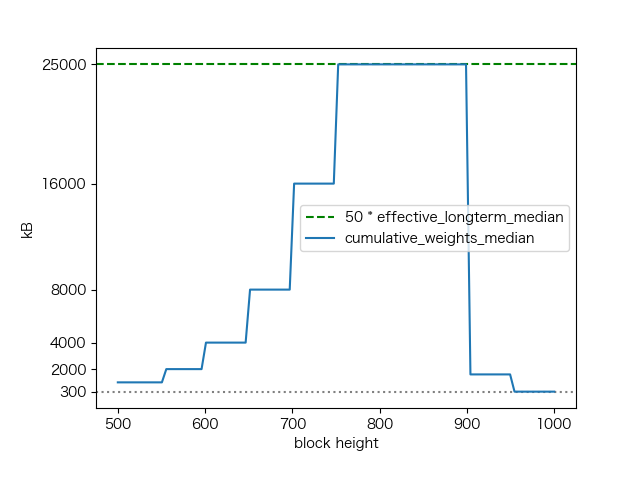
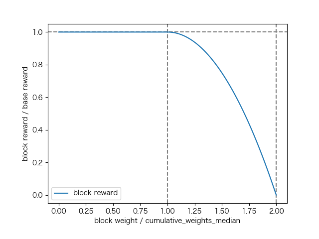

# Monero 简介

了解 Monero 最好的资料就是官方出的电子书 [Zero to Monero, the Second Edition](https://web.getmonero.org/library/Zero-to-Monero-2-0-0.pdf)。我之前是使用 LiquidText[^1] 做了[标注](https://www.dropbox.com/s/yfrh1bx0jxnvkqp/Zero-to-Monero-2-0-0_LT.pdf?dl=0)。

[^1]: LiquidText 是个很好的把书拆成块然后再联系起来的工具，类似的有 MarginNote 3，不过我觉得 LiquidText 简单够用，而且 PDF 标注能和其它工具打通。

如果是想快速的了解，可以从交易结构入手，看每个字段具体的作用是什么，这个我之前有做过[一份索引](https://www.xmind.net/m/dtiuxs/)。

在 Zero to Monero 开头的简介中，对 Monero 做了一个定义：

> Monero is a standard one-dimensional distributed acyclic graph (DAG) cryptocurrency blockchain where transactions are based on elliptic curve cryptography using curve Ed25519, transaction inputs are signed with Schnorr-style multilayered linkable spontaneous anonymous group signatures (==MLSAG==), and output amounts (communicated to recipients via ECDH) are concealed with ==Pedersen commitments== and proven in a legitimate range with ==Bulletproofs==.

前半句我们都很熟悉了，关键在后面三点：

1. MLSAG 签名。
2. Pedersen commitments.
3. Range proof with Bulletproofs.

下面会介绍下这三点和另外两个我觉得挺有意思的功能：动态块大小和动态最小手续费。这次主要是介绍概念，不会涉及任何数学，有兴趣或者工作需要用到再去了解也不迟。

## MLSAG 签名

MLSAG 是一种环状签名，涉及到 n 组公钥，每组里有 m 个公钥。

$$
\begin{bmatrix}
    K_{1,1} & K_{1,2} & K_{1,3} & \dots  & K_{1,m} \\
    \vdots & \vdots & \vdots & \ddots & \vdots \\
    K_{\pi,1} & K_{\pi,2} & K_{\pi,3} & \dots  & K_{\pi,m} \\
    \vdots & \vdots & \vdots & \ddots & \vdots \\
    K_{n,1} & K_{n,2} & K_{n,3} & \dots  & K_{n,m} \\
\end{bmatrix}
$$

这个签名有以下三个性质。

首先，只有知道其中一组公钥对应的 m 个私钥才能构造出正确的签名。这保证了所有权的验证。

然后，拿到签名，没有办法知道到底是 n 组中的哪一组的私钥构造出的签名。这保证了隐私性。

最后，如果是同一组私钥构造的签名，就算其它 n - 1 组公钥完全不同，也很很简单地判断出来。这保证了双花验证。

前面两条有点像这个图：

具体应用到 Monero 中，每个 input 是单独签名的。这个我一开始先入为主，认为是所有 inputs 一起做签名，绕了好久才发现想错了。所有 UTXO 在链上都公布了两个公钥，我们记作 K 和 C。其中 K 是通过用户的密钥对生成的一次性地址，C 是对金额的 Commitment，会用在 Pedersen commitments 中。而 K 和 C 就是 n 组公钥中用户知道私钥的那一组，也就是 m = 2。另外 n - 1 组是和这个 UTXO 无关的在链上的另外几个 outputs 的 K 和 C。构造签名需要根据一定规则找到这些 outputs。

## Pedersen commitments

Pedersen commitments 是用来在不公布具体数额的情况下能够验证 outputs 这和等于 inputs 之和。

其实就是一种同态加密，加密之前 inputs - outputs = 0。而加密转换后还是满足 inputs - outputs = 0。

Monero 中 output 的 commitment 就是自己那组公钥中的 C。

## Range proof with Bulletproofs

Pedersen commitments 有个问题就是加密转换之后虽然满足了 inputs - outputs = 0，但是加密之前的数字可能存在负数。而 Bulletproofs 就是用来证明其中没有负数，具体就不展开说了。

## 动态块大小

我用写过一篇详细的[介绍文章](https://blog.iany.me/2020/09/monero-dynamic-block-weight/)。这里简单说明一下。

Monero 里块的大小是动态调整的。过去 100 个块实际的块大小的中位数是基础块权重。块最大不能超过基础块权重的两倍。如果所有块都打满了，每过 50 个块就可以翻倍。但是这个翻倍不是无限制的，还有另外一个天花板，不能超过过去 100,000 个块的中位数的 50 倍。如果保持满块，大概每隔 50,000 个块增长 40%。

增长是受限制的，但是这些上限下降却是非常快的，比如只要 50 个空块，马上基础块权重就直接跌到最小值。

另外一个有意思的是，如果一个块超过了基础块权重，是会有惩罚的。最差的情况，当块是基础权重两倍的时候，块奖励变成 0。也就是说，矿工要出一个超过基础权重的块，得有足够的手续费激励才行。

## 动态最小手续费

Monero 里最小手续费率也是动态调的，主要目的是防止手续费远远超过块奖励。

大体上的调整趋势有两个：

* 一个块的总的手续费比块奖励小一个数量级，至少不超过块奖励。这里块奖励是惩罚之前的数额。
* 当网络拥堵时，交易提高手续费从而导致块扩容，而块扩容之后会带来更低的手续费。

## FAQ

* Ethereum 有类似的动态 Block Weight 调整，参考 [EIP1559](https://github.com/ethereum/EIPs/blob/master/EIPS/eip-1559.md)
* Monero 的 Bulletproofs 不需要可信设置，但是 Zcash 中所应用的 zkSNARK 则需要。缺点是 Monero 中的 proofs 和输入是线性相关的。